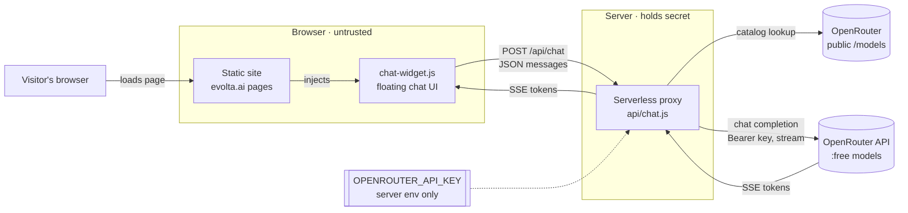
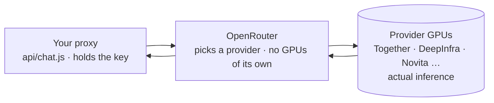
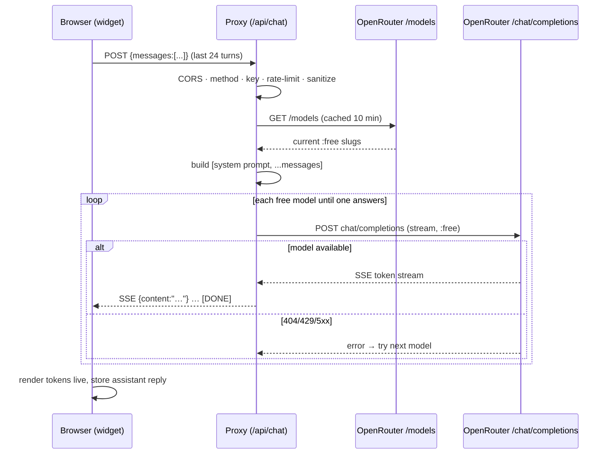
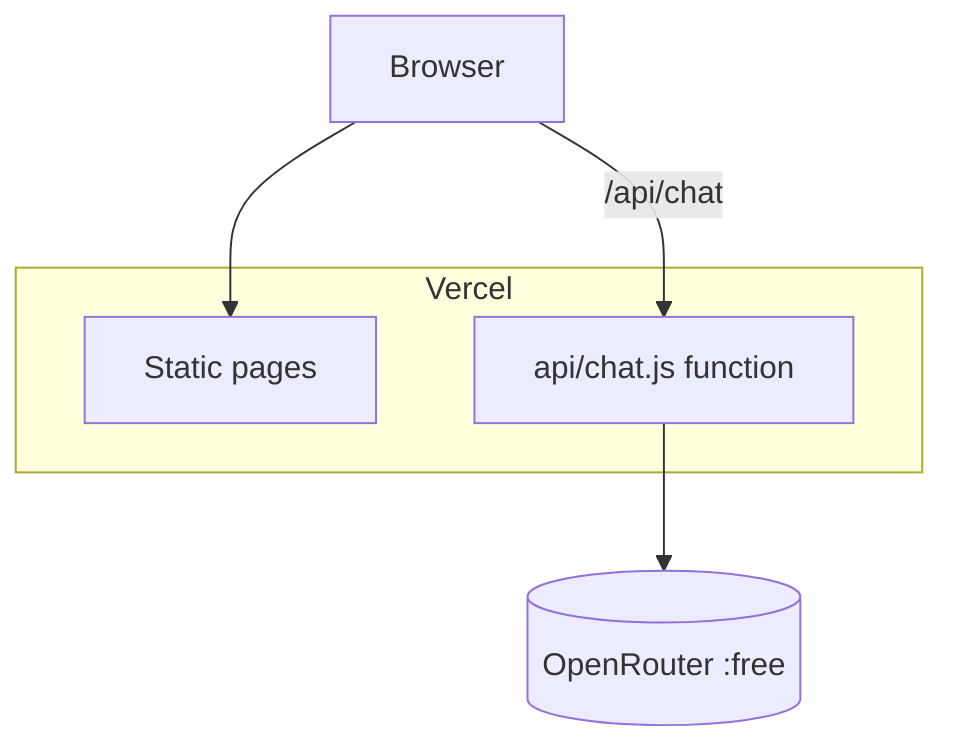
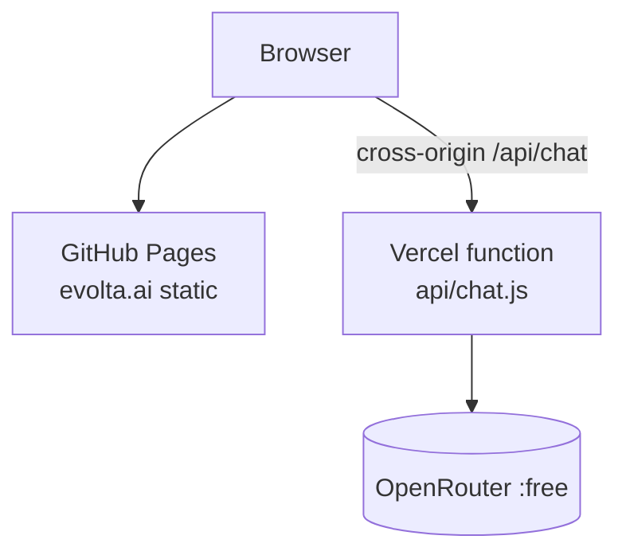
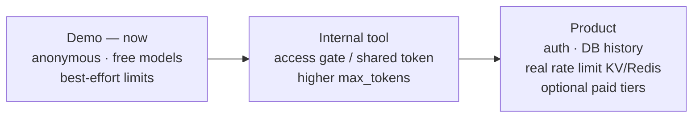

# Evolta Assistant — High-Level Design (HLD)

**System:** Evolta Assistant — a free, embeddable AI chat agent for the Evolta learning site (`evolta.ai`).
**Status:** Live (demo stage). Deployed at `https://evolta-two.vercel.app`.
**Owner:** mmedabo · **Repo:** `mmedabo/Evolta`

---

## 1. Purpose & context

Evolta is a free, non-profit learning platform (interactive games, simulations and
articles on trading, finance, energy, maths/stats, physics and philosophy). The
Evolta Assistant is a chat widget on the site that answers visitors' questions and
points them to the right learning game.

It is built to grow along a deliberate path: **demo → internal tool → product**.

### Goals
- **Free to operate.** Uses **OpenRouter free-tier models only** (zero model cost).
- **Zero secret exposure.** The OpenRouter API key never reaches the browser.
- **Drop-in.** One `<script>` tag adds the widget to any page; no build step, no deps.
- **Resilient.** Keeps working as OpenRouter's free-model catalog churns.
- **Streaming UX.** Replies appear token-by-token.

### Non-goals (at demo stage)
- No user accounts / auth.
- No server-side persistence of chat history.
- No paid models, no per-user billing.
- Hard, distributed rate limiting (current limiter is best-effort — see Risks).

---

## 2. System context

The **trust boundary** is the key design decision: the API key lives only in the
server environment. The browser talks exclusively to our own `/api/chat`; it never
sees the key or calls OpenRouter directly.

---

## 3. Components

| Component | Tech | Responsibility |
|-----------|------|----------------|
| **Static site** | Plain HTML (GitHub Pages / Vercel static) | Serves the learning pages; loads the widget via one `<script>`. |
| **Chat widget** (`assets/chat-widget.js`) | Vanilla JS, zero deps, self-injecting CSS | Floating button + panel, conversation state, streaming render, safe markup. |
| **Chat proxy** (`api/chat.js`) | Node ≥18 serverless function (Vercel) | Holds the key, enforces free-only models, discovers live models, injects system prompt, rate-limits, CORS, streams reply. |
| **OpenRouter** | External API | Routes to underlying free LLMs; returns OpenAI-style streamed completions. |

### 3.1 How the free models actually run (and why they're free)

**OpenRouter does not run the models on its own GPUs.** It is a *router / marketplace*:
it forwards each call to whichever upstream provider hosts that model, and that
provider's GPUs perform the inference.

- **Open-weight models** (Llama, Qwen, Gemma, Nemotron, GLM…) are typically served by
  several inference providers; OpenRouter selects one by price, latency and uptime.
- **Closed models** (GPT, Claude, Gemini) are routed to the vendor's own first-party API.
- **`:free` slugs** run on a provider's subsidized free tier — which is why they are
  rate-limited (429s) and occasionally retired (404s), and why the proxy discovers the
  live catalog and falls through across models.

**Why anyone offers it free — the value exchange.** Free is not charity; every party
gets something back, and the caller "pays" in data and reliability rather than cash:

| Party | What they get from the free tier |
|-------|----------------------------------|
| **Inference providers** (run it) | Acquisition funnel to their paid tier; **training/tuning data** from logged free traffic; utilization of otherwise-idle GPUs; volume that proves speed/uptime and wins paid routing. |
| **Model makers** (build it) | Adoption & mindshare for open-weight models; ecosystem lock-in that drives cloud/enterprise sales; free distribution via OpenRouter's catalog. |
| **OpenRouter** (routes it) | Developer acquisition; upsell to paid models on the same key (the actual business); stickiness once a stack routes through it. |
| **Evolta** (pays in kind) | **$0 cash** — no GPUs, no per-token bill — in exchange for: prompts possibly **logged/used for training** (provider-dependent), and **no SLA** (rate limits, variable latency, models retired without notice). |

**Implication for Evolta:** a free tier is appropriate for a public learning assistant.
The moment the chat handles anything sensitive or needs reliability guarantees, switch
to a **paid or first-party provider** with a real data policy and SLA (see the roadmap in
§7). A visual version of this lives in `docs/` as the "Evolta Assistant Flow" diagram.

---

## 4. Request lifecycle (happy path)

---

## 5. Deployment topology

Two supported shapes. The proxy needs a server that can hold a secret, so it always
runs on Vercel; the static pages can live with it or stay on GitHub Pages.

### Option A — Everything on Vercel (recommended, currently live)
One origin ⇒ the widget calls same-origin `/api/chat`, no CORS needed.

### Option B — Site on GitHub Pages, proxy on Vercel
Pages can't hold a secret, so only the proxy goes to Vercel. Requires `ALLOWED_ORIGINS`
(CORS) and a `window.EVOLTA_CHAT_ENDPOINT` override in the page.

---

## 6. Cross-cutting concerns

| Concern | Approach |
|---------|----------|
| **Secret management** | Key in Vercel env var `OPENROUTER_API_KEY`; never in repo (git-ignored `.env`), never sent to client. |
| **Cost control** | Only `:free` slugs are ever called — enforced at model resolution (suffix + price=0 checks). Spend is structurally pinned to zero. |
| **Availability** | Live model discovery + fall-through across many free models: one retired/rate-limited model can't break the chat. |
| **Abuse / rate limiting** | Best-effort per-IP in-memory limiter (default 20 req / 60 s); message size/turn caps. |
| **CORS** | Allow-list (`ALLOWED_ORIGINS`), defaults to evolta.ai + localhost. |
| **Streaming** | Server-Sent-Events–style protocol; `vercel.json` allows up to 60 s function duration. |
| **XSS safety** | Widget escapes all model output, then re-allows only `**bold**` and `http(s)` links. |
| **Privacy** | No chat storage; disclaimer in the UI ("don't share sensitive info"). |

---

## 7. Evolution roadmap

| Stage | Additions |
|-------|-----------|
| **Demo (now)** | Anonymous chat, free models, in-memory limits. |
| **Internal tool** | Vercel password protection or shared-token header; raise `max_tokens`. |
| **Product** | Persist history + real rate limiting (Vercel KV / Upstash Redis / Supabase), auth, optional paid models per plan. |

---

## 8. Assumptions & risks

| # | Risk | Mitigation / note |
|---|------|-------------------|
| 1 | Free models are frequently rate-limited (429) or retired (404). | Live discovery + fall-through across ≤8 models per request. |
| 2 | In-memory rate limiter resets on cold start and isn't shared across instances. | Acceptable for demo; back with KV/Redis before "product". |
| 3 | Free-model quality is lower than GPT-4/Claude. | Acceptable for a learning-guide assistant; system prompt keeps scope tight. |
| 4 | Vercel Hobby caps function duration below Pro. | `max_tokens: 1024` keeps responses short; lower `maxDuration` if the plan rejects 60 s. |
| 5 | OpenRouter free tiers may require data-sharing / have daily caps. | Configurable via `OPENROUTER_MODELS`; monitored via `X-Evolta-Model` header. |

See [LLD.md](LLD.md) for module-level detail and [IMPLEMENTATION.md](IMPLEMENTATION.md) for the build/deploy workflow.
