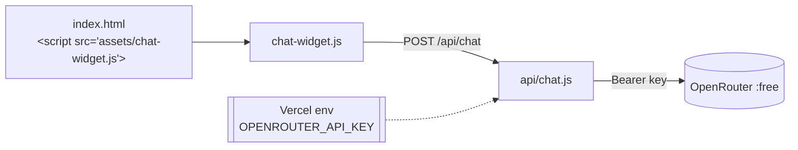
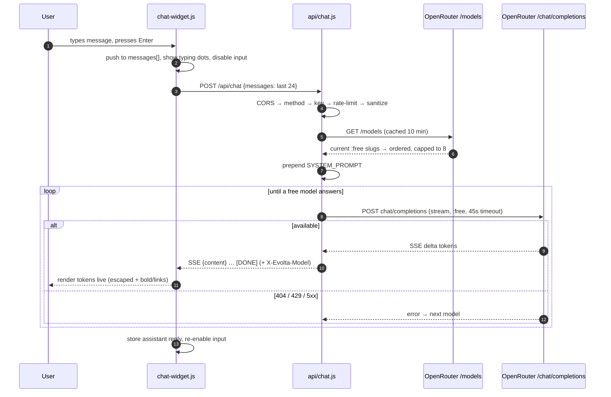
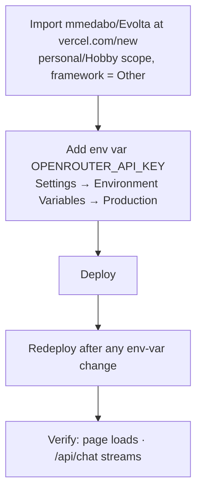

# Evolta Assistant — Implementation & Workflow

Practical guide: how the feature is built, how to run/deploy it, and the end-to-end
workflow from a keystroke to a streamed answer. See [HLD.md](HLD.md) for architecture
and [LLD.md](LLD.md) for module detail.

---

## 1. Repository layout

```
Evolta/
├── index.html              # homepage — loads the widget before </body>
├── *.html                  # game / learning pages (Aporia, Collision, …)
├── assets/
│   └── chat-widget.js      # front-end widget (vanilla JS, zero deps)
├── api/
│   └── chat.js             # serverless proxy → OpenRouter (holds the key)
├── vercel.json             # allow /api/chat to stream up to 60s
├── package.json            # declares Node ≥18 (for global fetch)
├── .env.example            # documents env vars (no real values)
├── .gitignore              # keeps .env out of git
├── CHAT_SETUP.md           # deploy/config quick-start
└── docs/                   # HLD / LLD / this file
```

The site is static. The **only** server-side piece is `api/chat.js`, which exists so
the OpenRouter key stays server-side.

---

## 2. How the pieces connect



Adding the widget to any page is two lines before `</body>`:
```html
<!-- optional cross-origin proxy (Option B only) -->
<!-- <script>window.EVOLTA_CHAT_ENDPOINT = "https://YOUR-PROJECT.vercel.app/api/chat";</script> -->
<script src="/assets/chat-widget.js" defer></script>
```

---

## 3. End-to-end request workflow



---

## 4. Local development

Prereqs: **Node ≥18**, the **Vercel CLI** (to run the serverless function locally).

```bash
npm i -g vercel
```
```bash
cd Evolta && cp .env.example .env    # then put your key in .env (git-ignored)
```
```bash
vercel dev                           # serves the static site + /api/chat locally
```
Open the printed `localhost` URL and use the chat bubble. `localhost` origins are in
the default CORS allow-list.

> Static-only preview (no chat backend): any static server works
> (`python3 -m http.server`), but `/api/chat` will 404 without `vercel dev`.

---

## 5. Deployment workflow

### 5.1 First-time setup (Vercel, free/Hobby plan — recommended: whole site on Vercel)

- Pick your **personal (Hobby)** scope, not a Team, to avoid the Pro upsell.
- Env-var changes only take effect on a **new deployment** — redeploy after adding the key.

### 5.2 Ongoing changes (git-driven)
Once the Vercel project is connected to GitHub, every push to `main` auto-deploys:
```bash
git add -A && git commit -m "…" && git push origin main   # → Vercel builds & deploys
```
Feature work on a branch → open a PR → Vercel posts a **Preview** deployment
(needs the env var enabled for the *Preview* environment too).

### 5.3 Verify a deployment
```bash
# page + widget asset
curl -s -o /dev/null -w "%{http_code}\n" https://<app>.vercel.app/assets/chat-widget.js
```
```bash
# live streamed reply (shows which free model answered)
curl -s -D - -X POST https://<app>.vercel.app/api/chat \
  -H "Content-Type: application/json" \
  -d '{"messages":[{"role":"user","content":"What is Evolta?"}]}'
```
Look for `HTTP/2 200`, an `x-evolta-model:` header, and `data:` token frames.

---

## 6. Operations & troubleshooting

| Symptom | Likely cause | Fix |
|---------|--------------|-----|
| `500 "missing OPENROUTER_API_KEY"` | Env var unset, or set to wrong environment, or not redeployed | Add key to **Production**, then **Redeploy**. |
| `502` with `"unavailable for free … use paid slug"` | Hardcoded free slug retired | Handled automatically now (live discovery); if it persists, set `OPENROUTER_MODELS` to a current `:free` slug from <https://openrouter.ai/models?max_price=0>. |
| `429` | Local limiter or all free models busy | Wait for the window; raise `CHAT_RATE_LIMIT`; retry (free tiers are bursty). |
| Widget/API `404` on the live site | Vercel deployed a branch without the feature | Ensure the deployed branch (usually `main`) contains `api/` + `assets/chat-widget.js`. |
| Deploy rejects `maxDuration: 60` | Plan caps function duration | Lower `vercel.json` → `functions.api/chat.js.maxDuration`. |
| "New Project" asks for Pro | Scope is a Team | Switch to your **personal/Hobby** scope (or use `vercel` CLI). |

**Monitoring hooks:** the `X-Evolta-Model` response header tells you which free model
served a request — useful for spotting when your preferred models are being skipped.

---

## 7. Change checklist (before pushing)

- [ ] No secret in the diff (`git grep -nE "sk-or-" -- . ':!*.md'` returns nothing).
- [ ] `node --check api/chat.js` passes.
- [ ] Only `:free` models can be reached (discovery + env-override guards intact).
- [ ] Widget still escapes model output (no raw HTML injection).
- [ ] If you added a page, it includes the widget `<script>` before `</body>`.
- [ ] Tested a live/preview `/api/chat` call end-to-end.

---

## 8. Extending toward "product" (pointers)

| Want | Where to change |
|------|-----------------|
| Real rate limiting | Replace the `hits` Map in `api/chat.js` with Vercel KV / Upstash Redis incr-with-TTL. |
| Chat history / auth | Add a DB (e.g. Supabase) + an auth gate; persist `messages` server-side. |
| Different persona / routing | Edit `SYSTEM_PROMPT` in `api/chat.js`. |
| Widget on every game page | Add the two `<script>` lines before `</body>` on each `*.html`. |
| Pin specific models | Set `OPENROUTER_MODELS` (comma-separated `:free` slugs). |
| Longer answers | Raise `max_tokens` in the upstream payload (watch function duration on Hobby). |
