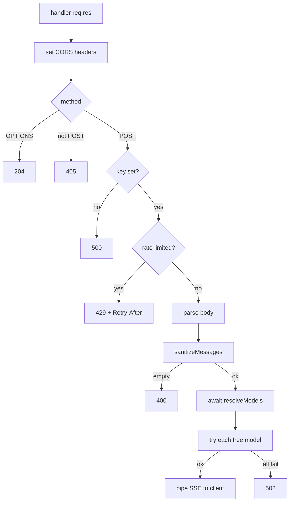
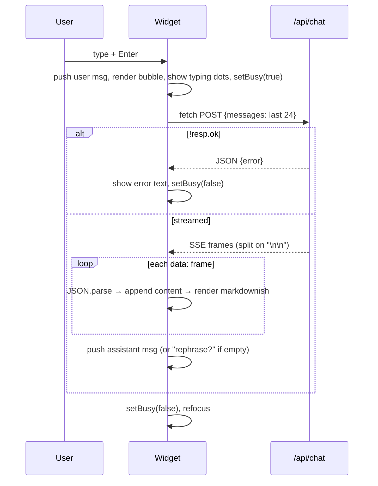

# Evolta Assistant — Low-Level Design (LLD)

Companion to [HLD.md](HLD.md). Describes the two source modules, the API contract,
data structures, and failure handling in implementation detail.

Files:
- `api/chat.js` — server-side proxy (Node ≥18 serverless function).
- `assets/chat-widget.js` — self-contained front-end widget.
- `vercel.json`, `package.json`, `.env.example` — deploy/config.

---

## 1. API contract — `POST /api/chat`

### Request
```jsonc
{
  "messages": [
    { "role": "user",      "content": "What is Evolta?" },
    { "role": "assistant", "content": "Evolta is …" }
  ]
}
```
- `role` is coerced to `assistant` or `user` (anything else → `user`).
- Client sends only the **last 24 turns**; the server re-caps regardless.

### Response — success (`200`, streamed)
`Content-Type: text/event-stream`. Minimal SSE frames:
```
data: {"content":"Evolta "}

data: {"content":"is a free "}

data: [DONE]
```
Header `X-Evolta-Model` reports which free slug actually answered.

### Response — errors (JSON)
| Status | When | Body `error` |
|--------|------|--------------|
| `400` | empty/invalid `messages` | "Provide a non-empty `messages` array." |
| `405` | non-POST method | "Method not allowed. Use POST." |
| `429` | local rate limit **or** all free models rate-limited | "Too many messages…" / "The free models are busy…" |
| `500` | `OPENROUTER_API_KEY` missing | "Server is not configured…" |
| `502` | network failure / all models exhausted | "The assistant is unavailable…" |
| `204` | CORS pre-flight (`OPTIONS`) | *(no body)* |

Mid-stream failure emits `data: {"error":"stream_interrupted"}` and ends.

---

## 2. `api/chat.js` — module structure



### 2.1 Configuration constants
| Const | Value | Meaning |
|-------|-------|---------|
| `DEFAULT_MODELS` | 5 current `:free` slugs | Offline fallback if live catalog unreachable. |
| `SYSTEM_PROMPT` | multi-line string | Defines the assistant persona + game routing + bilingual rule + "don't invent facts". |
| `DEFAULT_ALLOWED_ORIGINS` | evolta.ai (+www) + localhost | CORS default. |
| `MAX_MESSAGES` | `24` | Turns forwarded upstream. |
| `MAX_CHARS_PER_MSG` | `4000` | Per-message cap. |
| `MAX_TOTAL_CHARS` | `16000` | Whole-conversation cap. |
| `UPSTREAM_TIMEOUT_MS` | `45000` | Per-model abort timeout. |
| `RATE_LIMIT` | env `CHAT_RATE_LIMIT` or `20` | Requests per IP per window. |
| `RATE_WINDOW_MS` | env `CHAT_RATE_WINDOW_MS` or `60000` | Window length. |
| `MODEL_CACHE_TTL_MS` | `600000` | Live-catalog cache lifetime. |
| `MODEL_TRY_LIMIT` | `8` | Max models attempted per request. |
| `NON_CHAT` | regex | Excludes safety/guard/moderation/embed/rerank slugs. |

### 2.2 Free-model discovery (self-healing)
```
resolveModels()  // async, cached in module scope
  1. If OPENROUTER_MODELS env set → use it, filtered to slugs ending ":free".
  2. If cache fresh (< 10 min) → return cached list.
  3. fetchLiveFreeModels(): GET https://openrouter.ai/api/v1/models
       keep id.endsWith(':free') AND pricing.prompt==0 AND pricing.completion==0
       drop NON_CHAT slugs
  4. Order = DEFAULT_MODELS still-live first, then rest; slice to MODEL_TRY_LIMIT.
  5. On fetch failure → DEFAULT_MODELS.
```
**Safety rail:** every path guarantees only `:free` slugs are ever returned, so a
paid model can never be billed even via a bad env override.

### 2.3 Rate limiter (`rateLimited(ip)`)
- `hits: Map<ip, number[]>` of request timestamps.
- Drops timestamps older than the window; pushes now; limited when count > `RATE_LIMIT`.
- Opportunistic cleanup when `hits.size > 5000`.
- **Best-effort only:** per-instance memory, resets on cold start (see HLD Risk #2).

### 2.4 `sanitizeMessages(raw)`
- Rejects non-arrays (`null` → 400 upstream).
- Per item: coerce role, coerce/trim content to `MAX_CHARS_PER_MSG`, skip empties,
  stop at `MAX_TOTAL_CHARS`, then keep the last `MAX_MESSAGES`.

### 2.5 CORS (`pickCorsOrigin` / `allowedOrigins`)
- Echoes the request `Origin` if it's in the allow-list, else the first allow-listed
  origin. Sets `Vary: Origin`.

### 2.6 Upstream call & fall-through
Per model in the resolved list:
- `fetch(.../chat/completions)` with `Authorization: Bearer <key>`, attribution
  headers (`HTTP-Referer`, `X-Title`), body `{model, messages, stream:true,
  temperature:0.6, max_tokens:1024}`, aborted after `UPSTREAM_TIMEOUT_MS`.
- **On thrown error or any non-OK status:** if more models remain → `continue`;
  else return `429` (if last was 429) or `502` with a truncated `detail`.
- **On OK:** set streaming headers (`text/event-stream`, `no-cache`,
  `X-Accel-Buffering: no`, `X-Evolta-Model`), then re-emit tokens.

### 2.7 Stream translation (OpenRouter → client)
Reads the upstream body, buffers, splits on `\n`, and for each `data:` line parses
JSON and extracts `choices[0].delta.content`, re-emitting it as
`data: {"content":"…"}\n\n`. Emits `data: [DONE]\n\n` at end; on mid-stream throw
emits `data: {"error":"stream_interrupted"}`. Always clears the timeout and ends.

---

## 3. `assets/chat-widget.js` — module structure

Self-invoking IIFE; guards double-load with `window.__evoltaChatLoaded`.

| Concern | Detail |
|---------|--------|
| **Endpoint** | `window.EVOLTA_CHAT_ENDPOINT || '/api/chat'` (same-origin default). |
| **State** | `messages: [{role,content}]` (client-only), `busy: boolean`. |
| **Styling** | One injected `<style>`; namespaced `.evolta-*`; fixed FAB + panel. |
| **DOM** | FAB button → panel (header, `.evolta-body`, textarea + send, disclaimer). Mounted on `body` (or `DOMContentLoaded`). |
| **Greeting** | Static bot bubble on load. |
| **Input UX** | Textarea autosize; **Enter** sends, **Shift+Enter** newline; send button. |
| **Safe render** | `escapeHtml()` → then re-allow `**bold**` and `http(s)` links only (`rel="noopener noreferrer"`). Prevents XSS from model output. |

### 3.1 `submit()` flow

- Network throw → "Connection hiccup…". Empty stream → "…try rephrasing?".
- Frame parsing mirrors the server protocol (`data:` prefix, `[DONE]` sentinel).

---

## 4. Data structures

| Structure | Shape | Where |
|-----------|-------|-------|
| Message | `{ role: 'user'\|'assistant', content: string }` | both ends |
| `hits` | `Map<ip:string, timestamps:number[]>` | proxy (rate limit) |
| `modelCache` | `{ at: number, list: string[] }` | proxy (discovery cache) |
| Upstream payload | `{ model, messages:[{role:'system'\|…}], stream, temperature, max_tokens }` | proxy → OpenRouter |
| SSE frame | `data: {"content":string}` \| `data: [DONE]` \| `data: {"error":string}` | proxy → widget |

---

## 5. Failure-handling matrix

| Failure | Detected by | Behaviour |
|---------|-------------|-----------|
| Missing key | proxy | `500` immediately |
| Too many requests (local) | `rateLimited()` | `429` + `Retry-After` |
| Model retired (`404`) / busy (`429`) / upstream `5xx` | fetch status | fall through to next model |
| All models exhausted | end of loop | `429` or `502` with detail |
| Upstream timeout | `AbortController` | treated as thrown → next model or `502` |
| Stream breaks mid-reply | try/catch around reader | `data:{"error":"stream_interrupted"}`, end |
| Client offline / fetch throws | widget try/catch | "Connection hiccup…" |
| Empty completion | widget `!answer` | "…try rephrasing?" |

---

## 6. Configuration reference (env vars)

| Var | Required | Default | Purpose |
|-----|----------|---------|---------|
| `OPENROUTER_API_KEY` | ✅ | — | OpenRouter key (server only). |
| `OPENROUTER_MODELS` | — | live catalog | Comma-separated `:free` slugs, tried in order. |
| `ALLOWED_ORIGINS` | — | evolta.ai + localhost | CORS allow-list. |
| `CHAT_RATE_LIMIT` | — | `20` | Max requests / IP / window. |
| `CHAT_RATE_WINDOW_MS` | — | `60000` | Rate-limit window (ms). |

Client-side (optional, set before the widget script):
`window.EVOLTA_CHAT_ENDPOINT` — point the widget at a cross-origin proxy (Option B).
